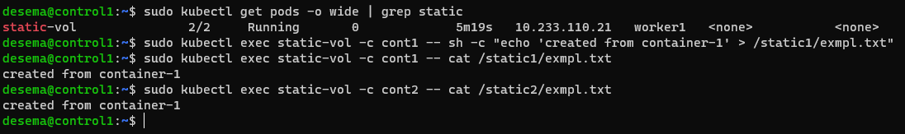
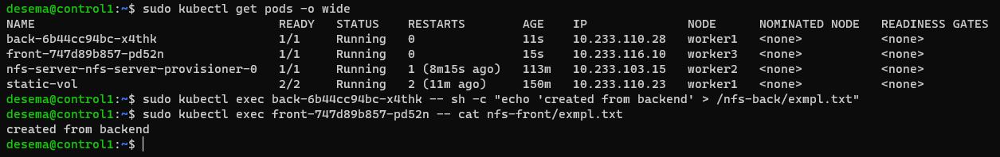

# Задание 1: подключить для тестового конфига общую папку

Создадим конфиг пода с общей папкой:
```yaml
apiVersion: v1
kind: Pod
metadata:
  name: static-vol
spec:
  containers:
    - name: cont1
      image: nginx
      volumeMounts:
        - mountPath: "/static1"
          name: static
    - name: cont2
      image: praqma/network-multitool
      env:
          - name: HTTP_PORT
            value: "88"
      volumeMounts:
        - mountPath: "/static2"
          name: static
  volumes:
    - name: static
      emptyDir: {}

```
Попробуем создать файл через первый контейнер и прочитать его из второго:


# Задание 2: подключить общую папку для прода
Установим nfs-provisioner через helm. Далее подготовим манифесты PV и PVC:
```yaml
apiVersion: v1
kind: PersistentVolume
metadata:
  name: pv-nfs
spec:
  storageClassName: "nfs"
  accessModes:
    - ReadWriteMany
  capacity:
    storage: 1Gi
  hostPath:
    path: /home/pv-nfs
    
---
kind: PersistentVolumeClaim
apiVersion: v1
metadata:
   name: pvc-nfs
spec:
   storageClassName: "nfs"
   accessModes:
     - ReadWriteMany
   resources:
     requests:
       storage: 100Mi

```
Добавим в конфигурации наших деплойментов (back/front) ссылки на волюмы:
<Br> для бэкенда:
```yaml
      containers:
          volumeMounts:
          - mountPath: /nfs-back
            name: nfs
      volumes:
      - name: nfs
        persistentVolumeClaim:
          claimName: pvc-nfs

```
и фронтенда:

```yaml
containers:
          volumeMounts:
          - mountPath: /nfs-front
            name: nfs
      volumes:
      - name: nfs
        persistentVolumeClaim:
          claimName: pvc-nfs
```


После этого попробуем записать файл через под бека и прочитать его с пода фронта:
